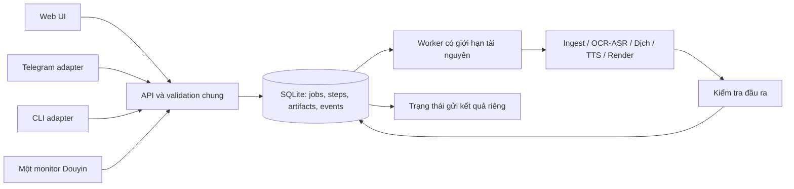

**Phân tích code và đề xuất nâng cấp Chinese SRT Extractor — 16/09/2026**

Phạm vi: checkout `bd36db8`, tập trung vào phần ứng dụng tự phát triển, các điểm nối với crawler Douyin và luồng Web/Bot/CLI. Không coi thư viện crawler vendored đã được kiểm toán đầy đủ. Báo cáo dựa trên đọc source, kiểm thử hiện có và các phép tái hiện cách ly; không gọi dịch vụ AI trả phí hoặc gửi Telegram trong quá trình rà soát.

**1. Nhận định chính**

Dự án đã có đủ thành phần cho một studio xử lý video cá nhân: nhận video/URL, Whisper ASR, Gemini OCR, dịch theo phong cách, TTS, làm sạch hình, in phụ đề, giữ âm gốc hoặc trộn BGM và monitor Douyin. Giá trị nâng cấp lớn nhất hiện nay nằm ở tính đúng đắn của điều phối và chất lượng kết quả, trước khi bổ sung thêm model.

Điểm yếu trung tâm là nhiều luồng cùng điều phối các service vốn tự thay đổi trạng thái job. “Unified Pipeline” mới thống nhất một phần giao diện; Web truyền thống, Studio, Bot và monitor vẫn có đường xử lý riêng. Điều này giải thích các lỗi cụ thể: upload Studio khởi động thêm Whisper, tác vụ con đánh dấu hoàn thành sớm, mất thông tin speaker và monitor ghi nhận video lỗi là đã xử lý.

Ưu tiên phù hợp: sửa lỗi dữ liệu/trạng thái → một đầu mối chạy job và quản lý GPU → lưu trạng thái bền vững → tối ưu xử lý video dài → nâng chất lượng OCR/dịch/TTS. Với ứng dụng cá nhân Windows, SQLite và một worker có giới hạn là bước đầu hợp lý; chưa cần thêm Redis/Celery hoặc tách nhiều dịch vụ triển khai.

**2. Quy mô và cấu trúc hiện tại**

| Thành phần | Quy mô/đặc điểm | Nhận xét |
|---|---|---|
| Python ứng dụng, không tính `services/douyin_monitor/spider` | 31 file, 11.156 dòng | Đủ lớn để cần hợp đồng dữ liệu và phân lớp rõ |
| `routes/api.py` | 1.920 dòng, 47 route | Trộn validation, upload, worker dispatch, khôi phục artifact, CRUD và presentation |
| `bot.py` | 1.769 dòng | Vừa giao tiếp Telegram, vừa cấu hình, vừa điều phối pipeline |
| `templates/index.html` | 4.202 dòng | HTML/CSS/JavaScript/polling/logic workflow nằm chung |
| `services/burn_sub.py` | 919 dòng; `burn_sub_video()` 476 dòng | Nhiều chế độ render, OCR, audio và subprocess trong cùng hàm |
| Hai engine TTS | `tts.py`: 383 dòng; `srt_to_tts.py`: 697 dòng | Khác cách truyền speaker, cache, duration và job context |
| Điều phối Studio | `pipeline_orchestrator.py`: 571 dòng | Gọi service có side effect lên chính job cha |
| Kiểm thử | 11 file, 63 ca được thu thập | Có giá trị nhưng thiếu ca xuyên suốt các điểm nối |

Luồng hiện tại: Web → route → thread/service; Bot → thread/executor/service; monitor trong mỗi tiến trình → bridge → Whisper/TTS/burn. Hai tiến trình Web và Bot có `jobs`, semaphore, monitor và cleanup worker riêng, nhưng dùng chung thư mục dữ liệu và các file JSON cấu hình.

Những nền tảng tốt cần giữ:

- Lazy-load Whisper; có CPU fallback và sử dụng `int8_float16` khi CUDA phù hợp.
- Có parser/validator SRT chung, FFprobe kiểm tra đầu vào ở nhiều route, kiểm tra URL/IP ban đầu, và hàm `safe_stem()`.
- Đã có Telegram allowlist, `parse_bool()`, API shutdown mặc định bị vô hiệu hóa. Cấu hình kiểm tra trong lượt này: Web bind `127.0.0.1`, GPU slot bằng 1, allowlist user/chat đều đã được cấu hình.
- Có batch dịch, retry TTS, cache segment và báo `failed_segments`/`partial` ở cấp TTS.
- Có chế độ giữ audio gốc bằng stream copy và tách riêng clean plate/pure burn.
- Tests đã kiểm tra SRT, hình học mask, TTS, chunk upload, audio mapping và một số luồng FFmpeg thực trên fixture nhỏ.

**3. Các phát hiện cần ưu tiên**

P1: có thể làm sai/mất kết quả, xử lý trùng, vượt giới hạn tài nguyên hoặc vượt phạm vi file cho phép. P2: giảm chất lượng, hiệu suất, khả năng vận hành hoặc bảo trì. Mức độ bảo mật được đánh giá trong bối cảnh ứng dụng đang bind localhost.

| Mã | Mức | Phát hiện | Bằng chứng chính |
|---|---|---|---|
| F01 | P1 | Upload Studio lớn tự chạy Whisper trước khi khởi động pipeline | `templates/index.html:1297`, `routes/api.py:518`, `routes/api.py:575`; đã tái hiện dispatch |
| F02 | P1 | Duyệt SRT dùng preview bị cắt ngắn, polling ghi đè phần đang sửa | `pipeline_orchestrator.py:298`, `templates/index.html:1356`; đọc trực tiếp source |
| F03 | P1 | Pipeline báo done khi thiếu đầu vào/kết quả hoặc TTS partial; hủy chưa xuyên suốt | `pipeline_orchestrator.py:458`, `:508`, `:565`; đã tái hiện |
| F04 | P1 | Web/Bot có thể cùng monitor, cùng xử lý một video; GPU lock chỉ trong tiến trình | `app.py:35`, `bot.py:1677`, `config.py:142`; đối chiếu launcher và entrypoint |
| F05 | P1 | Monitor đánh dấu video lỗi là đã xử lý | `daemon.py:219`, `pipeline_bridge.py:225`, `:302`; đã tái hiện với ASR lỗi giả lập |
| F06 | P1 | GPU slot timeout vẫn cho chạy | `config.py:148`; đã tái hiện acquire thất bại nhưng vẫn vào vùng cần khóa |
| F07 | P1 | Cleanup bỏ job đang tạo TTS/chờ duyệt; suy đoán phục hồi có thể đổi kết quả thành done | `config.py:197`, `routes/api.py:691`; đã tái hiện cleanup |
| F08 | P1 | Đọc file ngoài outputs qua status trên Windows; tên đầu ra inpaint chưa được làm sạch | `routes/api.py:694`, `burn_sub.py:585`; route đọc ngoài root đã tái hiện bằng fixture |
| F09 | P1 | Finish upload xóa session trước khi kiểm tra thiếu chunk; thiếu kiểm tra chiều dài chunk/file | `routes/api.py:418`, `:453`; đã tái hiện |
| F10 | P1 | SRT→TTS có thể sinh timestamp đảo chiều; cắt lời nhưng vẫn báo done | `srt_to_tts.py:251`, `:294`, `:591`; đã tái hiện ca timeline dày |
| F11 | P2 | AI trả thiếu một dòng thì các dòng AI hợp lệ cũng bị thay bởi Google | `translation.py:334`; đã tái hiện |
| F12 | P2 | Hai đường TTS làm mất speaker, aligned SRT và tính nhất quán cache/engine | `pipeline_orchestrator.py:463`, `:469`, `:535`; đọc source |
| F13 | P2 | Gateway OCR gửi toàn video base64, giới hạn output 4.096 token nhưng thiếu phát hiện cắt cụt | `hardsub_gemini.py:122`; đọc source, chưa benchmark provider |
| F14 | P2 | Làm sạch video mã hóa nhiều lần, bỏ qua chiều ngang ROI chọn tay | `clean_pipeline.py:73`, `:93`, `:204`; đọc source |
| F15 | P2 | Validation, frontend và kiểm thử chưa theo một hợp đồng thống nhất | Numeric option trả HTTP 500; polling thiếu partial/cancelled; fixture phụ thuộc dữ liệu local |

**F01 — Upload Studio lớn đang đi nhầm đường xử lý**

Giao diện dùng `uploadFileChunked(..., 'pipeline', ...)` cho file lớn hơn 50 MiB. Nhưng `/api/upload/finish` chỉ phân biệt hardsub và nhánh mặc định; `upload_type='pipeline'` rơi vào nhánh khởi chạy `process_video()`. Sau đó frontend gọi `/api/pipeline/run` với cùng job ID. `start_pipeline_job()` lại gọi `create_job()`, thay bản ghi của job đã tồn tại.

Hậu quả: Whisper chạy ngoài yêu cầu, có thể tải model/chiếm GPU, ghi SRT hoặc video trùng với pipeline và phát sinh trạng thái không nhất quán. Đây là lỗi chức năng có đường kích hoạt thực tế từ UI, không chỉ là khả năng do người dùng gọi API sai.

Đề xuất: tách ingest khỏi xử lý. `finish` chỉ trả artifact nguồn đã xác thực, với nhánh tương thích rõ ràng cho API cũ; pipeline mới là nơi duy nhất enqueue. Dùng idempotency key và từ chối tạo lại job đang hoạt động bằng HTTP 409.

Nghiệm thu: upload Studio 200 MiB không gọi Whisper trước lệnh run; chọn “chỉ in sub” không load ASR; retry `finish`/`run` không tạo thêm worker; file MKV/MOV vẫn được tìm đúng theo artifact ID.

**F02 — Duyệt phụ đề đang dùng dữ liệu rút gọn và có thể mất bản sửa**

Pipeline lưu `preview=target_srt_content[:500]`. UI đổ `preview` vào `reviewSrtTextarea` trong mỗi lượt polling 1.500 ms. Khi xác nhận, textarea được gửi lại như toàn bộ SRT mới. Nếu preview cắt đúng sau các block hợp lệ, validator vẫn có thể chấp nhận nhưng phần cuối phụ đề đã mất; nếu cắt giữa block, người dùng gặp lỗi validation. Trong khi đang gõ, lượt polling tiếp theo còn ghi đè bản sửa bằng preview cũ.

Đề xuất: tải toàn bộ nội dung qua endpoint đọc SRT/artifact hiện có, chỉ nạp khi bước chuyển sang `awaiting_review`; theo dõi `dirty` và revision; autosave bản nháp; submit kèm phiên bản nền và xử lý xung đột. Không dùng preview làm dữ liệu chỉnh sửa.

Nghiệm thu: mở/sửa SRT 1.000 câu, đợi ít nhất ba lượt polling rồi xác nhận; đủ 1.000 câu và giữ nguyên phần sửa. Chờ duyệt qua restart không mất bản nháp.

**F03 — Cần tách trạng thái pipeline khỏi trạng thái bước**

`_execute_remaining_steps()` bỏ qua TTS/burn khi thiếu nội dung, nhưng vẫn đặt `done` ở cuối. Kết quả `partial` của TTS được lưu vào trường con nhưng không làm pipeline thành partial. Đã tái hiện một job có `cancel=True`, chọn TTS/burn nhưng thiếu đầu vào: kết quả vẫn `done`, artifacts rỗng. Cũng đã tái hiện `tts_vi.status='partial'` trong khi trạng thái cha là `done`.

Ngoài ra, nhánh Whisper gọi `process_video()` vốn tự đánh dấu job `done` trước các bước clean/TTS/burn. Frontend dừng polling khi thấy done, nên có cửa sổ dừng theo dõi quá sớm. `srt_to_mp3()` tạo một job con mới; cờ hủy/progress của job cha không được truyền thành cùng context. Vòng chờ file Gemini trong orchestrator chưa có deadline/cancel như `hardsub_worker()` riêng.

Đề xuất: service trả `StepResult`; chỉ orchestrator được đổi trạng thái tổng. Trước mỗi bước phải kiểm tra dependency, cancellation và kết quả bước trước. Kết quả phải phân biệt `done`, `partial`, `failed`, `cancelled`, `skipped`. Không tự coi bước bắt buộc thiếu input là skipped. TTS partial mặc định chuyển chờ xử lý/bù đoạn thay vì tự tuyên bố thành phẩm hoàn chỉnh.

Nghiệm thu: lỗi ASR/dịch/TTS/FFmpeg truyền đúng lên cha; cancel không bị ghi đè thành done; yêu cầu bước nào phải có artifact bước đó; poll không kết thúc ở giữa pipeline.

**F04–F06 — Một chủ thể điều phối monitor và GPU**

`start_all.bat` khởi chạy Web và Bot thành hai tiến trình. Cả `app.py` và `bot.py` đều gọi `start_monitor(interval=3600)`. Kiểm tra `is_monitor_running()` và `threading.Semaphore` không có tác dụng giữa hai tiến trình. Hai monitor có thể đọc cùng lịch sử chưa xử lý, cùng tạo `dy_<aweme_id>` và ghi cùng output. Hai cleanup worker cũng không biết job đang hoạt động ở tiến trình kia.

Trong một tiến trình, `acquire_gpu_slot()` chờ mặc định 600 giây; khi acquire thất bại, hàm chỉ in cảnh báo rồi vẫn `yield`. Khóa do đó không bảo đảm trần concurrency. EasyOCR khởi tạo theo CUDA nhưng không dùng cùng semaphore; model Whisper được cache theo kích thước mà không có chính sách unload. Tuần tự inference không đồng nghĩa toàn bộ model đang giữ VRAM đã nằm trong ngân sách.

Monitor còn có lỗi kết quả: `execute_auto_pipeline()` trả bình thường khi ASR lỗi và bắt exception cuối hàm mà không ném lại. Daemon tiếp tục `mark_as_downloaded()`. Phép tái hiện xác nhận video lỗi ASR vẫn được thêm vào lịch sử; những lượt sau sẽ bỏ qua nó. Bộ lọc “từ 0 giờ hôm nay” cũng có thể bỏ video đăng lúc máy offline sang ngày mới; fetch tối đa 18 video chưa chứng minh backfill đầy đủ.

Đề xuất theo hai bước:

- Ngay: chỉ một entrypoint chạy monitor; lock/claim theo aweme ID; timeout GPU phải trả lỗi retryable hoặc tiếp tục chờ có hủy, tuyệt đối không đi vào vùng cần khóa. Bao phủ OCR/Whisper/LaMa và kiểm tra encoder NVENC riêng với CUDA.
- Tiếp theo: Bot và Web gửi lệnh về cùng backend; một worker sở hữu GPU/model. SQLite lưu claim và state; phân biệt discovered, downloaded, processing, rendered, delivered, failed; `UNIQUE(source, source_id)` chống trùng. Render và gửi Telegram có trạng thái riêng để gửi lỗi không bắt render lại. Dùng watermark thời gian/checkpoint cùng cửa sổ backfill, không gán video cũ thành “đã xử lý” một cách ngầm định.

Nghiệm thu: Web/Bot/monitor cùng gửi video chỉ sinh một job; timeout không làm chạy GPU vượt slot; ASR lỗi vẫn retry được; mở lại máy sau một đêm không bỏ video chưa xử lý; dừng monitor phải phản ánh tiến trình thực đã ngừng.

**F07 — Cleanup và khôi phục cần dựa trên vòng đời thực**

Danh sách trạng thái giữ lại trong `cleanup_old_jobs()` thiếu `generating` và `awaiting_review`; tuổi tính từ lúc tạo, không phải lúc hoàn tất. Phép tái hiện với job 2 giờ tuổi: cả hai bị bỏ, còn `processing` được giữ. Sau khi mất record, bước dọn file có thể không nhận diện được artifact đang dùng. Hai tiến trình dùng chung thư mục làm nguy cơ lớn hơn.

`/api/status` có cơ chế phục hồi từ file, nên không chính xác nếu nói mọi kết quả đều mất khi restart. Tuy nhiên cơ chế này suy ra `done` từ SRT/MP3 tồn tại, không phục hồi pending review, lỗi từng đoạn, cancel hay lịch sử bước. File TTS partial có thể được dựng lại thành done; `tts_aligned_vi.mp3` được tách ngôn ngữ thành `aligned_vi` thay vì `vi` theo cách thay prefix hiện tại.

Đề xuất: lưu manifest/SQLite; cleanup theo `completed_at`, `last_access_at`, retention và lease đang hoạt động. Phân biệt cache tạm, nguồn, thành phẩm và bản nháp. Quét active job một lần cho mỗi lượt cleanup, thay vì lặp toàn bộ jobs trên mỗi path. Sau crash đánh dấu interrupted/recoverable, không suy đoán thành công.

**F08 — Kiểm tra đường dẫn chưa được áp dụng xuyên suốt**

Route pipeline đã kiểm tra job ID và video root, nhưng route status dùng `OUTPUT_FOLDER / job_id` trực tiếp khi phục hồi. Trên Windows, request với ID chứa dấu backslash đi qua route một đoạn và thoát root. Đã xác nhận HTTP 200 và đọc được preview của SRT fixture nằm ngoài thư mục output. Chỉ dùng file thử tạo riêng; không đọc dữ liệu nhạy cảm của người dùng.

Ở nhánh inpaint, tên output dùng `original_name[:30]` trực tiếp. Tên chứa slash, `..`, drive hoặc ký tự không hợp lệ Windows có thể làm sai đích ghi hoặc render thất bại. Phép tính đường dẫn với fixture chứng minh root có thể bị vượt; chưa chạy FFmpeg ghi file ngoài root. Các tham số `srt_path`/`target_srt_path` cũng cần cùng chính sách với video_path.

Đề xuất: áp dụng validator ID tại mọi route, hàm `resolve_under_root()` sau resolve, tên file nội bộ do server tạo, `safe_stem()` chỉ phục vụ nhãn tải xuống. API sử dụng artifact ID thay đường dẫn tùy ý. Trả status qua DTO allowlist thay vì chỉ bỏ vài key cấp trên. Nếu cần truy cập LAN, bổ sung authentication và kiểm tra Origin/Host; hiện chưa có lớp auth chung cho toàn bộ Flask API. Kiểm tra URL/IP ban đầu đã có, nhưng redirect và URL media do trang trích xuất vẫn cần chính sách riêng.

Nghiệm thu: slash/backslash/drive/UNC/encoded traversal đều bị từ chối; tên video Unicode vẫn hoạt động; mọi output resolve trong job root; API không trả bí mật lồng trong config.

**F09 — Chunk upload cần hợp đồng toàn vẹn và resume thật**

`upload_finish()` pop session trước khi kiểm tra đủ chunk. Tái hiện: finish khi thiếu phần trả 400; gửi nốt phần còn thiếu trả 404. `upload_chunk()` đọc toàn bộ payload bằng `.read()`, không giới hạn byte thực theo chunk_size. Finish chỉ kiểm tra file không rỗng và FFprobe đọc được, chưa yêu cầu kích thước cuối đúng tổng đã khai báo.

Phép thử upload khai báo 8 byte nhưng chỉ ghi file 5 byte vẫn đi qua khi media probe được mock hợp lệ. Điều này xác nhận thiếu kiểm tra toàn vẹn kích thước, không có nghĩa mọi file video cắt cụt đều qua được FFprobe.

Đề xuất: stream ghi có giới hạn; kiểm tra offset/kích thước chuẩn của từng phần và tổng; checksum chunk tùy nhu cầu; khóa theo session; giữ session khi còn thiếu; finish idempotent. Lưu metadata upload để resume sau restart. Theo dõi last activity thay vì tuổi tuyệt đối hai giờ. Cho file lớn nhưng phải có kiểm tra dung lượng đĩa dự phòng và số upload đồng thời.

**F10–F12 — TTS cần đo chất lượng thực, không chỉ zero overlap**

Ca biên SRT hợp lệ gồm câu 0–20 ms và câu tiếp theo bắt đầu 20 ms: mặc định safety margin 60 ms làm câu đầu bắt đầu ở 60 ms nhưng kết thúc -40 ms. Phép thử dùng âm tổng hợp, thay phần trim/time-stretch để cô lập logic timeline; SRT đầu vào hợp lệ, SRT đầu ra không hợp lệ, trong khi `overlap_ms` vẫn bằng 0 vì được gán cứng.

Với câu dài, giới hạn tốc độ có thể dẫn đến cắt đuôi audio (`speed_adjusted_clamped`). Chỉ trạng thái `failed` được cộng vào failed_segments, nên câu bị cắt vẫn góp vào kết quả done. “0% chồng chéo” không chứng minh đủ lời, đúng nghĩa hoặc đồng bộ chính xác với video. Pipeline cũng chưa dùng `res_tts['srt_path']` đã căn chỉnh để in sub theo lựa chọn; vẫn truyền SRT trước alignment.

Đường Studio gọi `srt_to_mp3()` sinh job ID mới và truyền một voice mặc định. `_resolve_voice()` ưu tiên custom voice cho mọi speaker. Kết quả dịch lưu speaker trong `segment_speakers`, không đưa tag vào SRT; đường standalone lại lấy speaker từ tag trong text. Vì vậy thông tin phân vai không đi xuyên suốt Studio. `synthesize_all_segments()` của standalone chỉ có nhánh Edge/Gemini, engine khác rơi về Edge dù docstring nêu OmniVoice. Cache file hiện dựa chủ yếu vào vị trí segment, nên sửa text/voice trong cùng job có thể dùng audio cũ ở đường có retry.

Đề xuất:

- Một `TTSService` dùng `segments[{id,start,end,text,speaker_id}]`, voice map theo engine và cùng JobContext; CLI chỉ là adapter.
- Cache key gồm text chuẩn hóa, voice, engine, model, language và style; retry chỉ đoạn lỗi/thay đổi; persist manifest để tránh gọi lại provider không cần thiết.
- Giải quyết cue quá ngắn/overlap bằng merge/split hoặc yêu cầu chỉnh lời; bảo đảm end > start; không cắt âm thầm. Câu quá dài: viết lại có giữ nghĩa → synthesize lại → time-stretch trong ngưỡng đã chọn → needs_review nếu vẫn không vừa.
- Đo overlap từ placement thực, kiểm tra SRT đã align trước export, FFprobe file MP3 đầu ra và so với video duration. Công bố thêm số câu bị cắt, tỷ lệ lời thiếu, độ lệch timestamp, phân bố tốc độ nói và lỗi engine.
- UI standalone phải xử lý terminal states `partial`, `cancelled`, `error`; hiện polling quanh `index.html:4095` chỉ hoàn tất với done/error.

Nghiệm thu: cue 20 ms/overlap/giáp nhau/đoạn cuối dài đều có kết quả xác định; không cắt lời mà báo done; multi-speaker giữ voice map; sửa một câu không dùng lại audio cũ; parent cancel dừng cả TTS con; aligned SRT được dùng đúng chế độ.

**F11 — Giữ lại phần dịch AI thành công**

Khi parse thiếu dòng, code gọi `_fallback_google()` trước khi đưa những dòng AI hợp lệ vào translated_map. Một batch hai câu với AI trả hợp lệ câu 1 vẫn gọi Google cho cả hai và reset cả hai speaker về M1; đã tái hiện. Nếu cả Google lỗi, giữ nguyên tiếng Trung nhưng cấu trúc SRT vẫn hợp lệ, dễ bị coi là dịch thành công.

Đề xuất: merge dòng AI hợp lệ trước; retry/fallback chỉ các ID còn thiếu. Ghi provider/model/fallback_reason theo segment. Kiểm tra ngôn ngữ còn sót, số cue, số/ký hiệu/đơn vị và tên riêng. Thêm glossary nhất quán cho thuật ngữ lái xe, tên nhân vật và xưng hô. Dùng JSON schema nếu gateway hỗ trợ, nhưng vẫn có validator ID/độ phủ phía ứng dụng. Gắn nhãn phân vai suy đoán từ text; không coi đó là nhận diện người nói từ audio.

**F13–F14 — Video dài cần thay đổi cách chia việc và encode**

Gateway OCR luôn tạo proxy rồi đọc cả file, base64 hóa và đóng JSON. Chỉ riêng base64 đã tăng khoảng 4/3 số byte, còn có các bản sao chuỗi/payload; vì vậy upload chunked không có nghĩa pipeline toàn trình có bộ nhớ ổn định. `max_tokens=4096` cho toàn video và không kiểm tra finish_reason tạo nguy cơ mất phụ đề cuối dù phần trả về vẫn là SRT hợp lệ. Proxy lỗi còn có thể quay lại file gốc lớn. Nhánh SDK trong orchestrator cần deadline, cancel, kiểm tra ACTIVE/FAILED và cleanup file remote như worker cũ.

Clean pipeline decode mọi frame bằng OpenCV, ghi trung gian `mp4v`, sau đó encode lại H.264; nếu Studio tiếp tục pure burn, còn thêm một lần encode. `any(...)` duyệt các interval cho từng frame có độ phức tạp xấp xỉ F×S. Chiều ngang ROI chọn tay bị thay bằng strip 90% width. Video VFR được dựng lại theo một FPS trung bình, cần kiểm thử PTS/audio sync; HDR/rotation cũng chưa được bộ test hiện tại chứng minh giữ đúng.

Đề xuất: chia OCR theo cảnh hoặc cửa sổ thời gian với overlap, checkpoint và cộng offset; kiểm tra độ phủ và phần cuối; crop ROI chữ thay vì downscale mù toàn khung. Cho clean và burn hợp nhất một encode khi không cần giữ clean plate, hoặc giữ mezzanine phù hợp khi cần duyệt/resume. Pipe frame tới FFmpeg có backpressure; quản lý timestamp bằng PyAV/FFmpeg cho VFR. Đổi interval scan sang con trỏ tiến; dùng ROI thực của người dùng và chỉ mở rộng theo cấu hình.

LaMa hiện có fallback OpenCV khi không có model/runtime hoặc inference lỗi. Test chỉ assert shape không chứng minh đã chạy LaMa. Nên trả `engine_requested`, `engine_actual`, `fallback_reason`, provider GPU/CPU; đo độ nhấp nháy giữa frame trước khi quyết định nâng sang model video inpainting theo thời gian.

**4. Danh mục tối ưu, kèm cách đo trước/sau**

| Khu vực | Thay đổi đề xuất | Lợi ích dự kiến | Đo để xác nhận |
|---|---|---|---|
| Điều phối | Queue có giới hạn; một chủ thể giữ GPU; semaphore không bỏ qua timeout | Giảm OOM và việc chạy trùng | Peak VRAM, số worker, số job trùng, thời gian chờ |
| TTS dài | Ghép theo cửa sổ hoặc ghi PCM theo offset thay overlay toàn master lặp lại | Hạn chế copy RAM trên mỗi segment | Peak RSS với 10/30/60 phút; thời gian ghép |
| TTS provider | Cache theo nội dung; retry ID còn thiếu; giới hạn concurrency theo provider | Giảm request/cost và độ trễ khi sửa một câu | Request count, cache hit, retry rate, chi phí/job |
| OCR | Chia clip, ROI, checkpoint, phát hiện cắt cụt | Ổn định bộ nhớ và độ phủ video dài | RSS, payload size, cue coverage, lỗi cuối clip |
| Inpaint | ROI đúng, interval pointer, tránh encode trung gian không cần thiết | Giảm CPU/I/O và suy hao hình | FPS, số encode, file tạm, SSIM/VMAF ngoài ROI |
| Model | Cache theo ngân sách VRAM; unload khi idle/chuyển model; health check encoder | Tránh VRAM bị giữ bởi nhiều model | VRAM sau load/switch/unload; fallback frequency |
| BGM | Cache stem theo hash audio; giữ Demucs CPU nếu GPU thiếu; loudness/peak QC | Giảm tách nhạc lặp và âm lượng thất thường | Thời gian Demucs, LUFS/true peak, kiểm nghe |
| Frontend | Tách JS/CSS; poll tuần tự có AbortController/backoff; sau đó cân nhắc SSE | Tránh chồng request, stale state và mất bản sửa | Requests/job, terminal state, reconnect/reload |
| Cleanup | Manifest tham chiếu artifact, retention theo loại, kiểm tra free disk | Tránh mất file cần dùng và đầy đĩa | Disk peak, số artifact orphan, phục hồi restart |

Đây là lợi ích dự kiến từ phân tích code, chưa phải kết quả benchmark. Không có cơ sở hiện tại để hứa nhanh hơn 2×, 5× hoặc hỗ trợ ổn định 50 GB. Các con số “vài giây”, “xóa sạch 100%”, “khớp 100%” trong README/docstring nên được thay bằng điều kiện đo và phạm vi chất lượng.

**5. Kiến trúc nâng cấp vừa đủ cho máy cá nhân**

Tách module theo trách nhiệm, không nhất thiết tách thành các service triển khai độc lập:

- `routes/uploads.py`, `routes/jobs.py`, `routes/pipeline.py`, `routes/douyin.py`: nhận request, validate và trả DTO.
- `services/job_store.py`: transaction, state transition, revision, claim/lease và khôi phục.
- `services/job_runner.py`: queue bounded, idempotency, cancel, scheduling và tài nguyên.
- `services/media_process.py`: FFmpeg/FFprobe thống nhất, progress, timeout theo tiến độ, terminate/wait/kill child process, cleanup.
- `services/tts_service.py`: provider adapter, segment manifest, cache, alignment và QC.
- `static/js/pipeline.js`, `upload.js`, `srt-editor.js`, `tts.js`: giảm coupling giữa các màn hình; chưa cần đưa vào framework frontend lớn.

Trạng thái tổng đề xuất: `queued → running → awaiting_review → running → done|partial|failed|cancelled`; thêm `interrupted` sau restart để quyết định resume. Bước xử lý có state riêng; chỉ job runner tổng hợp trạng thái cha. Artifact có loại, path nội bộ, size/hash, duration/codec, version và bước tạo ra nó. Schema request nên dùng typed model, enum và constraints; bool/numeric validation phải áp dụng cho cả cấu hình nested trong pipeline.

**6. Lộ trình triển khai và điều kiện hoàn tất**

Ước lượng theo một người đã quen code, chưa tính chờ quota/provider hoặc đánh giá chủ quan trên nhiều video. Các giai đoạn có thể giao từng phần, không cần chờ tái cấu trúc toàn bộ mới sửa lỗi.

| Giai đoạn | Ước lượng | Phạm vi | Điều kiện nghiệm thu |
|---|---|---|---|
| A — Sửa tính đúng đắn | 3–5 ngày | F01/F02/F03/F05/F06/F08/F09, bảo vệ cleanup, xử lý partial UI | Không dispatch trùng, không mất SRT, không done giả, khóa/path/upload đúng |
| B — Vận hành bền vững | 4–7 ngày | Một monitor/worker; SQLite; JobContext; idempotency; cancel/restart; tests isolation | Web/Bot thấy cùng job; resume sau crash; cleanup không xóa job active |
| C — Chất lượng dịch/TTS | 4–7 ngày | Sửa F10–F12, voice map, glossary, cache theo nội dung, aligned SRT, QC | Không mất câu/âm thầm cắt lời; giữ speaker; sửa 1 câu chỉ synth lại 1 câu |
| D — Hiệu năng video dài | 4–8 ngày | OCR chunk, ghép audio theo cửa sổ, giảm encode, ROI/VFR, benchmark | Đo được RAM/VRAM/disk/RTF; chất lượng không giảm theo tiêu chí đã chọn |

Nên bắt đầu bằng A. Có thể chạy B và C theo các đợt nhỏ sau khi khóa hợp đồng dữ liệu; tránh đổi tất cả route, TTS và render cùng lúc.

Những nâng cấp sản phẩm đáng làm sau khi nền ổn định: editor waveform/SRT có version; glossary theo kênh; preset chất lượng/tốc độ; preview clean ROI vài giây trước full render; màn hình so sánh original/clean; retry từ bước lỗi; manifest ZIP gồm video/SRT/audio/QC. Speaker diarization bằng audio hoặc model inpainting video chỉ nên thêm khi dữ liệu đánh giá chứng minh heuristic hiện tại không đạt nhu cầu.

**7. Kiểm chứng, giới hạn và khoảng trống kiểm thử**

Kết quả raw của các phép tái hiện: [probe-results.json](D:/Naldo/chinese-srt-extractor-final/chinese-srt-extractor/docs/audits/2026-09-16/probe-results.json). Kết quả bộ test chạy lại đầy đủ với fixture cách ly: [pytest-results.xml](D:/Naldo/chinese-srt-extractor-final/chinese-srt-extractor/docs/audits/2026-09-16/pytest-results.xml).

Lượt test đầu chạy trong thư mục tạm, chuyển uploads/outputs/monitor data sang fixture, bỏ token Telegram và để danh sách kênh trống: 62 passed, 1 failed, 14 warnings. Ca lỗi là `test_api_presets_endpoint` vì fixture ban đầu chưa copy preset `douyin_top_title`; copy `presets.json` hiện có vào thư mục tạm thì ca này passed. Sau đó chạy lại đầy đủ với fixture đã sửa: **63 passed, 14 warnings trong 26,57 giây**, được lưu trong JUnit XML. Đây là lỗi thiết lập lần kiểm tra đầu, không kết luận lỗi sản phẩm từ ca đó.

`venv/Scripts/python.exe -m pip check`: `No broken requirements found`. Điều này chỉ xác nhận metadata dependency trong venv hiện có, không chứng minh cài mới từ requirements thành công hoặc các provider hoạt động E2E. Tests emit cảnh báo `audioop` deprecated và PyTorch quantization deprecated; cần xác định Python hỗ trợ, xử lý trước khi nâng Python 3.13+.

Khoảng trống cần bổ sung bằng tests có ý nghĩa:

- Route-to-worker: upload pipeline không khởi động ASR; đồng thời run/continue/cancel; API trả 4xx khi input sai thay vì 500.
- Browser: edit full SRT, dirty state qua polling, partial/cancelled terminal state, reload/reconnect, large upload resume.
- State machine: lỗi ở từng bước, crash/restart, job partial, cleanup khi waiting/generating, parent/child cancellation.
- TTS: cue cực ngắn, timestamps dày, last cue overrun, model lỗi từng đoạn, đổi voice/text invalidates cache, speaker truyền xuyên pipeline.
- Media: 24/25/29.97/30/60 fps, VFR, portrait/landscape, Unicode paths, không audio, multi-audio, clip dài, âm thanh đuôi video, NVENC unavailable.
- Monitor: hai producer gửi cùng ID, ASR lỗi vẫn retry, gửi Telegram lỗi không render lại, catch-up sau downtime, scan thủ công sau stop.
- Cài mới: môi trường sạch không có sample WAV/model local; test LaMa phải phân biệt engine thật với fallback; tests không dùng config monitor thật.

Đáng chú ý: tests hiện có dùng sample WAV ở repo root và một số test LaMa chỉ kiểm tra shape. `test_douyin_monitor.py` thao tác file cấu hình mặc định nếu chạy trực tiếp không cách ly. Nên đưa fixtures vào temp bằng `conftest.py`, tách unit/integration/GPU/provider bằng markers. Test mặc định tuyệt đối không được kích hoạt gửi Telegram hoặc quét kênh thật.

Chưa thực hiện trong lượt này: gọi thật Gemini/Edge/OmniVoice/translation gateway, crawl hoặc gửi Telegram thật, xử lý video dài 2–50 GB, đo RTF/peak RAM/VRAM của từng chế độ, đánh giá nghe/xem toàn bộ thành phẩm. Những phần đó cần một bộ video chuẩn và đợt validation riêng; 63 tests hiện có không thay thế được kiểm tra chất lượng nội dung.

**8. Các chỉnh sửa vận hành nhỏ có lợi ngay**

- Cập nhật README: monitor đang đặt 3.600 giây, không phải 3 phút; audio extraction và clean mux vẫn có timeout 3.600 giây, chưa phải loại bỏ toàn bộ timeout.
- Launcher hiện dừng process giữ port 5000 bằng `Stop-Process -Force`; `stop_all.bat:7` còn dừng mọi `ffmpeg.exe` trên máy. Nên quản lý PID/identity của chính ứng dụng và shutdown có thời gian chờ để không dừng nhầm chương trình hoặc render khác.
- `setup_windows.bat` cài requirements trước torch trong khi chú thích requirements nói ngược lại; chỉ thấy `nvidia-smi` không chứng minh torch/CUDA/torchvision/NVENC tương thích. Chốt Python/runtime matrix và post-install smoke check; trả exit code nếu pip lỗi thay vì báo setup completed.
- Tách runtime/dev/optional dependencies; dùng lock/constraints riêng cho GPU/CPU. Ghi rõ Demucs, ONNX Runtime/LaMa model, OmniVoice là capability tùy chọn và báo fallback thật ở UI.
- Logging có cấu trúc theo job/step, error_code, attempt, elapsed, engine_actual và provider; lọc secrets. Giữ log FFmpeg cần chẩn đoán theo retention, thay vì chỉ đưa chuỗi lỗi vào status.
- Giới hạn request/queue theo tài nguyên dù file size đặt unlimited; tự đo free disk trước ingest/render. SSE chỉ là nâng cấp sau cùng nếu polling đúng vẫn đáp ứng tải local.

Trong lượt rà soát này chỉ tạo các artifact báo cáo dưới `docs/audits/2026-09-16`; chưa thay đổi mã chạy ứng dụng hoặc cấu hình người dùng.
